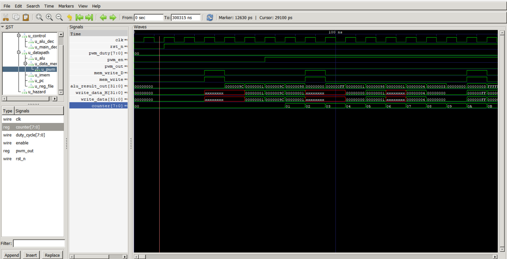
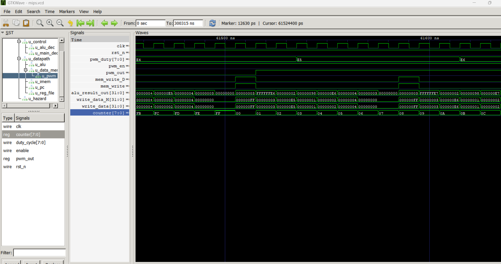

# Test Report

## Motor Profile Verification

Implemented option: A, ramp-up -> hold at maximum -> ramp-down -> hold at zero -> repeat.

Expected waveform regions:

1. PWM enable becomes 1 after a write to `0x9C`.
2. Duty register increases from 0 to 255 through writes to `0x98`.
3. Duty remains at 255 during the maximum hold loop.
4. Duty decreases from 255 to 0 through writes to `0x98`.
5. Duty remains at 0 during the zero hold loop.
6. The sequence repeats by jumping back to the ramp-up loop.

GTKWave screenshots:

The assembly program writes to the PWM duty MMIO address repeatedly. The ramp-up loop increments the duty value by 1, and the ramp-down loop decrements it by 1. Delay loops slow the visible duty changes. Hold loops keep the output at the maximum and minimum values before restarting.

## Edge Cases Tested

### Enable = 0

When the enable register is 0, the PWM controller drives `pwm_out` low and resets its counter. The program first writes 1 to `0x9C`, so normal operation starts only after PWM is enabled.

### Duty = 0

When duty is 0, the condition `counter < duty` is never true, so `pwm_out` remains low.

### Duty = 255

When duty is 255, `pwm_out` stays high for almost the entire 8-bit counter period and goes low only at the final counter value.

### Reset During Ramp

When reset is asserted, the PWM duty and enable registers return to 0. After reset is released, the instruction memory program starts again and rebuilds the ramp from the beginning.
